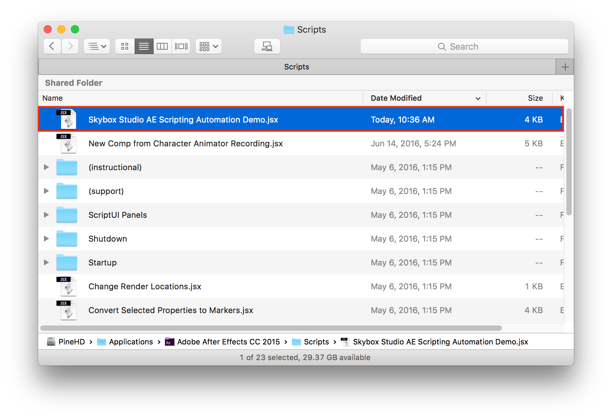
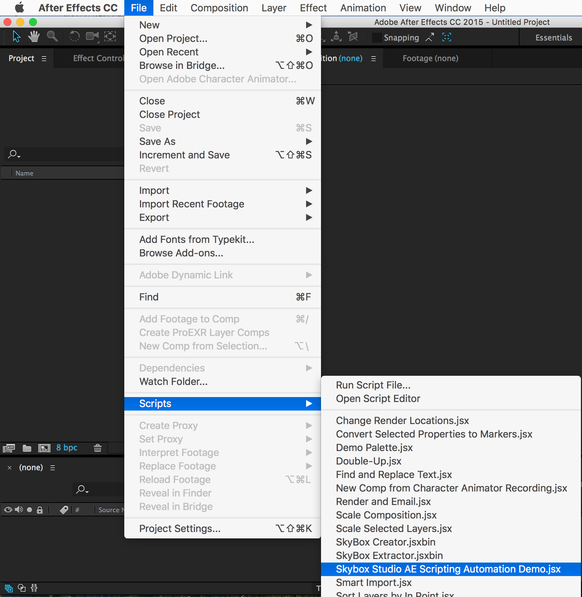
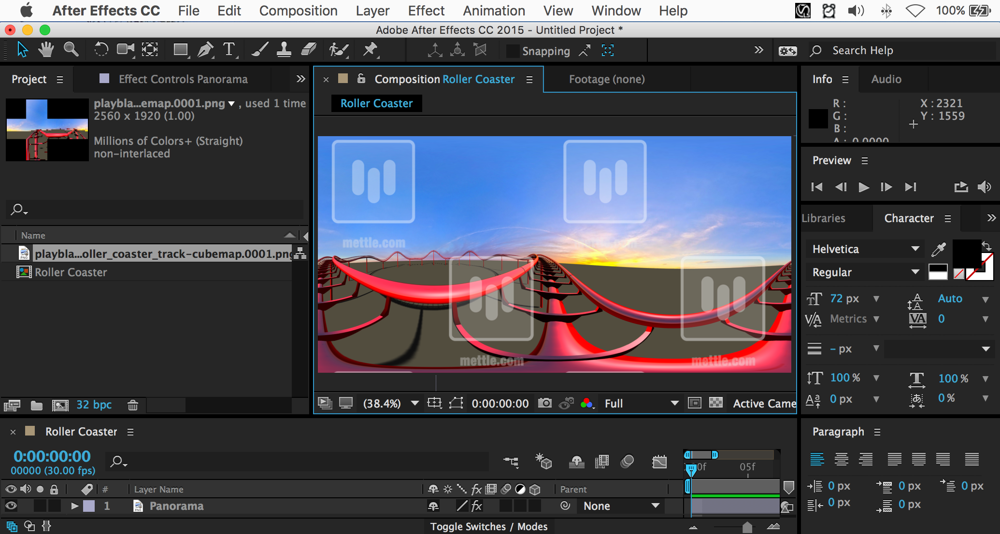
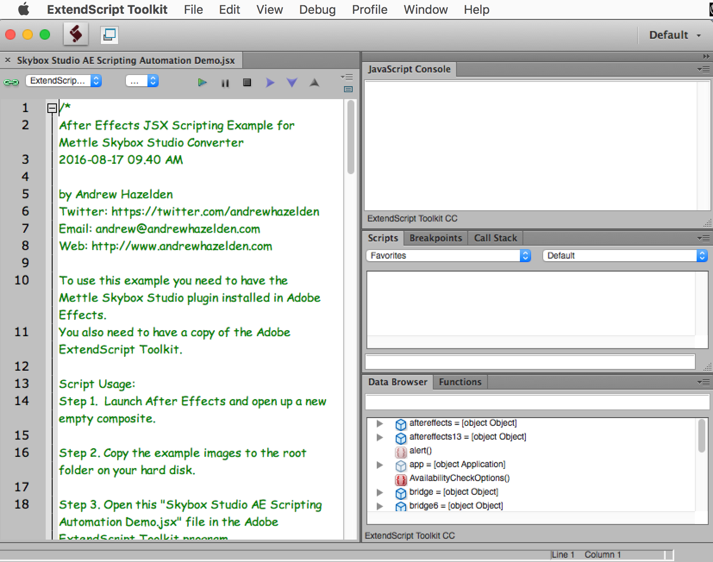

# Mettle Skybox Studio JSX Scripting Automation #
----
**Version 1.0** - 2016-08-17  
by Andrew Hazelden  

Email: [andrew@andrewhazelden.com](mailto:andrew@andrewhazelden.com)  
Web: [www.andrewhazelden.com](http://www.andrewhazelden.com)  

## Overview ##

This Adobe Extendscript JSX example shows how to automate the process of creating a new After Effects composite with the [Mettle Skybox Studio](http://www.mettle.com/product/skybox-studio/) Converter plugin automatically applied to an image.

You also can use this JSX example script to apply a custom image projection conversion or panoramic view rotation value too.

## Script Usage ##

To use this example you need to have the [Mettle Skybox Studio](http://www.mettle.com/product/skybox-studio/) plugin installed in Adobe Effects. You also need to have a copy of the Adobe ExtendScript Toolkit installed.

Step 1. Copy the two example images named `playblastvr_roller_coaster_track-cubemap.0001.png` and `playblastvr_roller_coaster_track-latlong.0001.png` to the root folder at the base of your hard disk.

Step 2. Copy the JSX script "Skybox Studio Scripting Automation Demo.jsx" to your After Effects Scripts folder.

**Mac OS X AE Scripts Path:**

> /Applications/Adobe After Effects CC 2015/Scripts/

**Windows AE Scripts Path:**

> C:\Program Files\Adobe\Adobe After Effects CC 2015\Support Files\Scripts\

Step 3. Start After Effects. From the **File > Scripts** menu select the item **"Skybox Studio Scripting Automation Demo.jsx"** file.

This will run the script and create a After Effects new composite with Skybox Studio Converter applied the media file.

Step 4. To customize the script example and adjust the settings, open this "Skybox Studio Scripting Automation Demo.jsx" file in the Adobe ExtendScript Toolkit program.

Step 4. Edit the "var imgPath" line to choose which of the two example images you want to use.

You can also try out different settings like the Tilt (X axis), Pan (Y axis), or Roll (Z axis) options in the script by removing the double slashes on those lines which are used to comment them out.

Step 5. To run the script, select "After Effects" as the target program in the ExtendScript Toolkit toolbar. Then click the triangle shaped "play" button in the toolbar.

